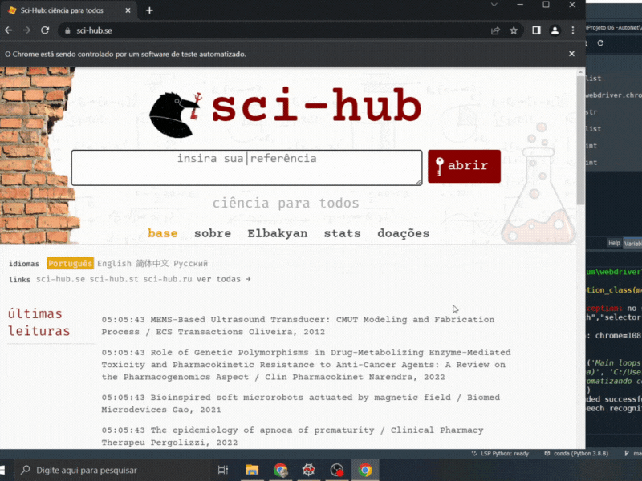

# Auto_SciHub
Type keywords and the script will automatically download dozens articles from Google Scholar.

## 💻 Requirements

- [Selenium](https://selenium-python.readthedocs.io/) 
- [PyAutoGUI](https://pyautogui.readthedocs.io/en/latest/)

## ☕ How to use

Change the variables "keywords" and "scholar_pages" to your specific needs. 

When running the script Google Scholar might require a Captcha. In this case manually solve it and run the main cell to surpass this anti-bot barrier.

## 📝 License

Feel free to use it and modify it in any way you want. If you want to give me credits, cite this repository. 

𝔉𝔞𝔯𝔢𝔴𝔢𝔩𝔩
